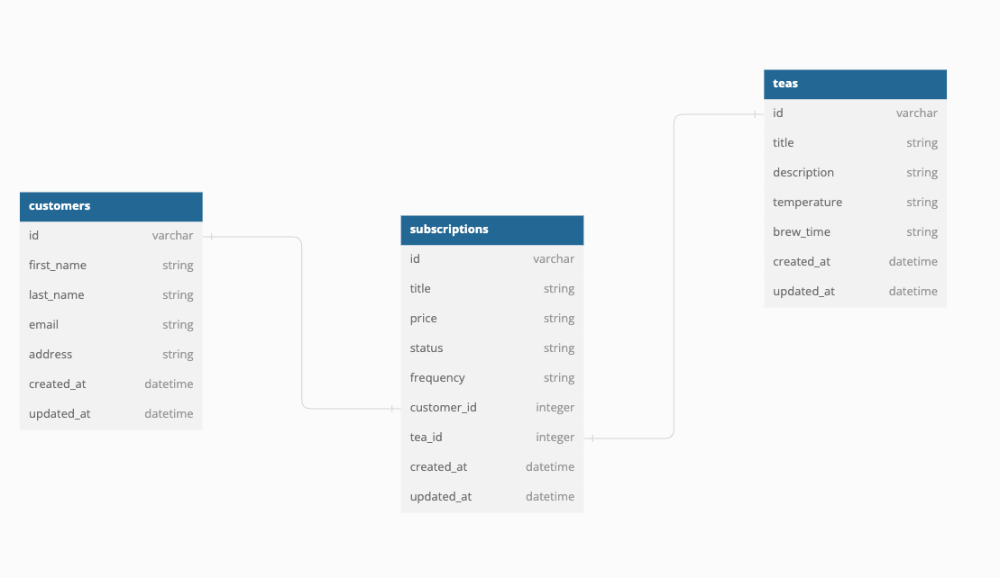

# Tea Service Subscription API

**Tea Service** is a backend application designed to store and display all the data from the tea subscription service. It allows the front end team to access this data and display it to the user. There are currently three endpoints in this API. The first is a ```GET``` request that displays all of a given users tea subscriptions, both active and cancelled. The second endpoint is a ```POST``` request that allows a user to create a new subscription by subscribing to a tea of their choosing. The final endpoint is a ```DELETE``` request that allows a user to cancel any of their active subscriptions. 

## Technologies Used
* 
* 
* 
* 
* 

## Running On
  - Rails 7.0.4
  - Ruby 3.1.1

## Testing
- **Framework:** RSpec 

## Getting Started 
To set up **Tea Service Subscription API** locally, follow the instructions below:

1. Make sure you have the appropriate version of Ruby and Rails on your machine, along with all of the required dependencies. 
2. Fork & Clone the repository
3. Install the required dependencies using bundler:
```
bundle install
```
4. Set up the database and migrations by running:
```
rails db:{drop,create,migrate,seed}
```
5. You should now have 24 passing tests when you run:
```
bundle exec rspec
```

## Database
**Here is a diagram of the tables in the database and their relationships to one another:**
<br><br>


* Configuration

* Database creation

* Database initialization

* How to run the test suite

* Services (job queues, cache servers, search engines, etc.)

* Deployment instructions

* ...
